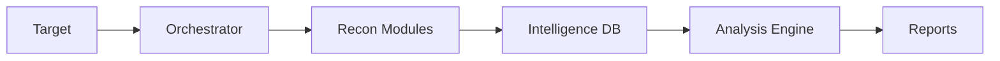

# 🕵️‍♂️ Hughes Clues - Elite OSINT Toolkit

```ascii
╦ ╦╦ ╦╔═╗╦ ╦╔═╗╔═╗  ╔═╗╦  ╦ ╦╔═╗╔═╗ - ELITE EDITION
╠═╣║ ║║ ╦╠═╣║╣ ╚═╗  ║  ║  ║ ║║╣ ╚═╝
╩ ╩╚═╝╚═╝╩ ╩╚═╝╚═╝  ╚═╝╩═╝╚═╝╚═╝╚═╝
```

> *"Elementary, my dear Watson... if Watson was a highly sophisticated OSINT automation toolkit."*

A comprehensive, async-powered OSINT reconnaissance suite that would make Sherlock Holmes upgrade his magnifying glass. 🔍

## 🌟 Features

### 🎯 Core Intelligence Gathering
- **Advanced DNS Enumeration** - Because sometimes the truth is in the DNS
- **WHOIS Analysis** - The digital equivalent of asking "Who goes there?"
- **SSL Certificate Intelligence** - Trust, but verify (the certificates)
- **Technology Fingerprinting** - Know your target's tech stack inside out

### ☁️ Cloud & Infrastructure
- **Cloud Asset Discovery** - Finding needles in the AWS/Azure/GCP haystack
- **Infrastructure Mapping** - Drawing the digital battlefield map
- **Port Scanning & Service Detection** - Every open door tells a story
- **Network Topology Analysis** - Understanding the lay of the LAN

### 🔐 Security Assessment
- **Vulnerability Scanning** - Finding the weak spots before others do
- **Breach Detection** - Because what's leaked can't be unleaked
- **GitHub Exposure Detection** - Hunting for secrets in the code
- **Risk Score Calculation** - Turning reconnaissance into actionable intelligence

### 🤖 AI-Powered Analysis
- **Pattern Recognition** - Finding the signal in the noise
- **Threat Assessment** - Predictive security analysis
- **Anomaly Detection** - Spotting the unusual in the usual

## 🚀 Quick Start

### Prerequisites
```bash
# Python 3.8+ required
python --version  # Should be ≥ 3.8
```

### Installation
```bash
# Clone the repository
git clone https://github.com/Know-Kname/oshint.git
cd oshint

# Create virtual environment
python -m venv venv
source venv/bin/activate  # Linux/Mac
.\venv\Scripts\activate   # Windows

# Install dependencies
pip install -r requirements.txt

# Setup configuration
cp config.yaml.example config.yaml
# Edit config.yaml with your API keys
```

### Basic Usage
```bash
# Basic reconnaissance
python master_orchestrator.py example.com

# Full intelligence gathering
python master_orchestrator.py example.com --comprehensive

# Specify custom operations
python master_orchestrator.py example.com --ops recon,geo,darkweb
```

## 📊 Sample Output

```
╔═══════════════════════════════════════════════════════════╗
║   HUGHES CLUES ELITE - INTELLIGENCE REPORT               ║
╚═══════════════════════════════════════════════════════════╝

Target: example.com
Risk Score: 65/100

KEY FINDINGS:
⚠ 3 vulnerabilities detected via Shodan
⚠ 2 potential secret exposures found on GitHub
⚠ 1 publicly accessible S3 bucket found
⚠ Email addresses found in 5 data breaches
```

## 🛠 Configuration

### API Keys
The following API keys can be configured in `config.yaml`:
- Shodan
- Censys
- VirusTotal
- SecurityTrails
- URLScan
- HaveIBeenPwned

### Example Configuration
```yaml
api_keys:
  shodan_key: 'your_shodan_key'
  censys_id: 'your_censys_id'
  censys_secret: 'your_censys_secret'
  virustotal_key: 'your_vt_key'
```

## 🏗 Architecture

### Core Components
- **Master Orchestrator** - The brain of the operation
- **Elite Modules** - Specialized reconnaissance units
- **Intelligence Aggregator** - Connecting the dots
- **Risk Analyzer** - Making sense of it all

### Data Flow


## 🛡 Security Considerations

- **Rate Limiting** - Respect API limits and target resources
- **Data Handling** - Secure storage of sensitive information
- **Ethical Usage** - Use responsibly and legally
- **API Key Protection** - Keep your keys secret, keep them safe

## 📝 License

This project is licensed under the MIT License - see the [LICENSE](LICENSE) file for details.

## 🤝 Contributing

Contributions are what make the open-source community an amazing place to learn, inspire, and create. Any contributions you make are **greatly appreciated**.

1. Fork the Project
2. Create your Feature Branch (`git checkout -b feature/AmazingFeature`)
3. Commit your Changes (`git commit -m 'Add some AmazingFeature'`)
4. Push to the Branch (`git push origin feature/AmazingFeature`)
5. Open a Pull Request

## 🙋‍♂️ Support

Encountered a bug? Have a feature request? Want to contribute? Check out our:
- [Issue Tracker](https://github.com/Know-Kname/oshint/issues)
- [Discussions](https://github.com/Know-Kname/oshint/discussions)
- [Documentation](docs/README.md)

## 🎭 Disclaimer

This tool is for educational and ethical purposes only. Users are responsible for compliance with applicable laws and regulations. The authors are not responsible for misuse or for any damage that may be caused by this program.

---

<div align="center">
Made with ❤️ and ☕ by the Hughes Clues Team
</div>
